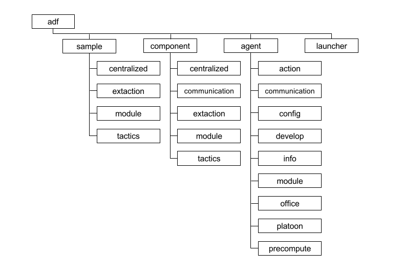

### Important directories of ADF (adf-sample) are:
- config/: configuration file of agents.
- src/: agents’ source codes. this directory contains the directories shown in Fig. 5.
- precomp data/: results of a precomputation for each type of agents.
- build/: agents’ Java classes.
- library/: libraries used by agents.

##### 重要文件一览
- config/: agents 的配置文件
- src/: agents的源代码文件
- precomp data/: 每种类型的agent的预计算数据
- build/: agents’ Java classes.　　编译之后的java class
- library/: libraries used by agents. 一些需要的库

